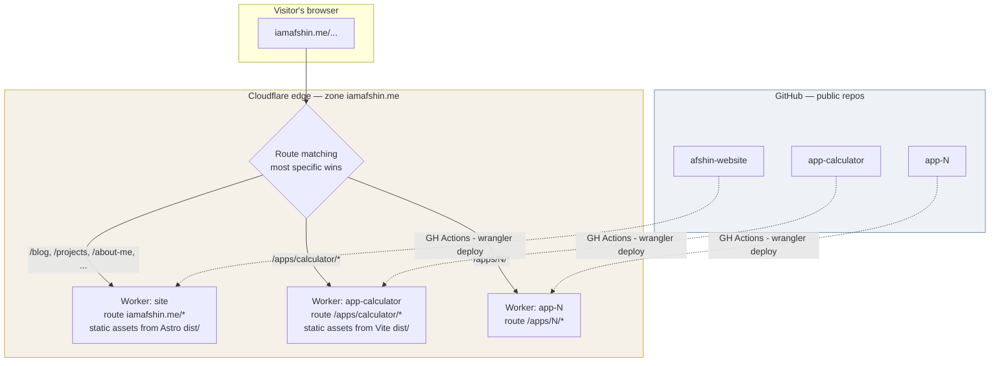
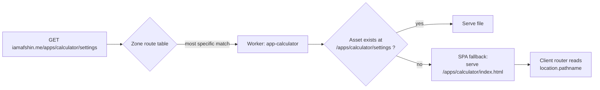
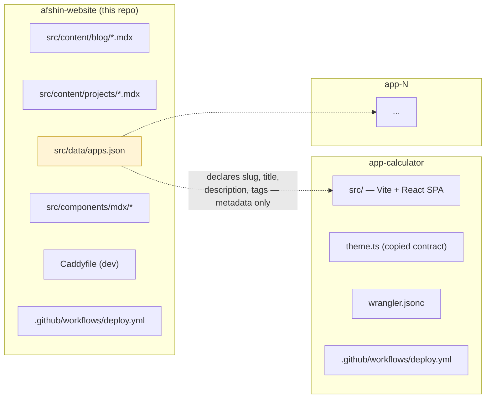
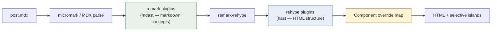
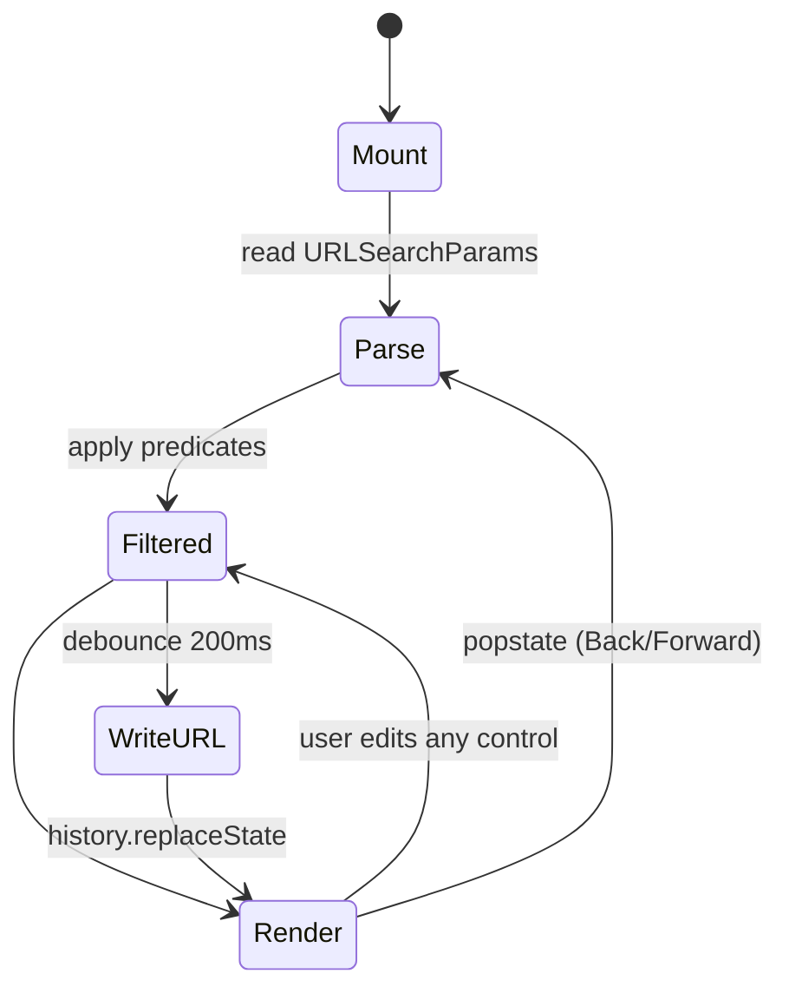
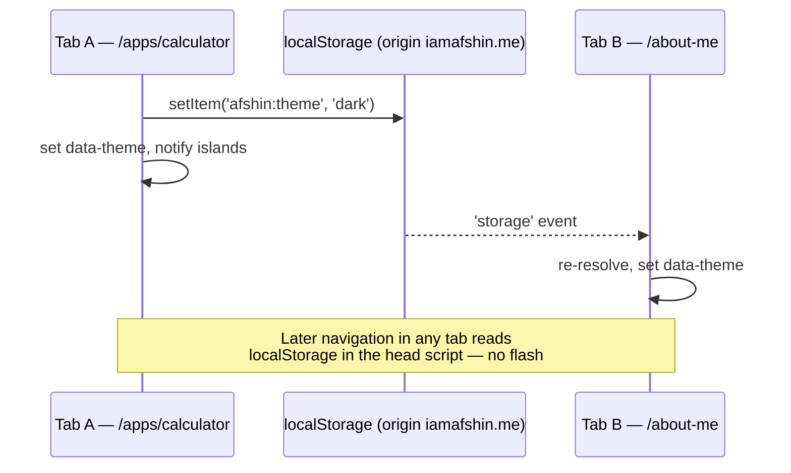
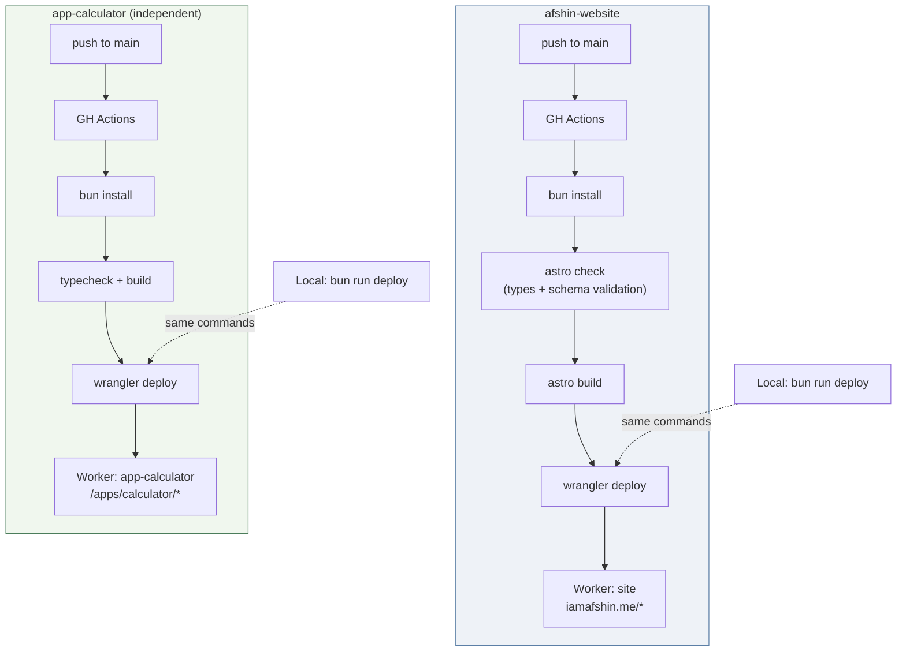
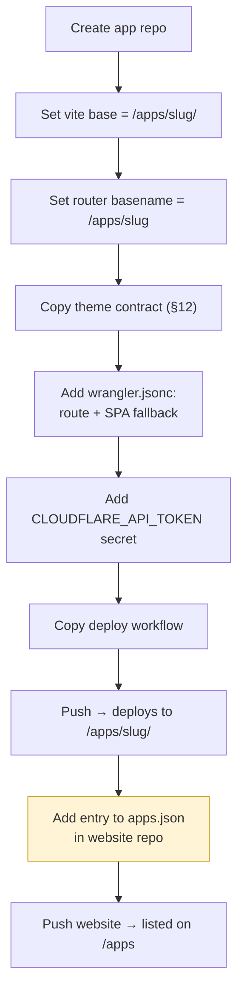

# iamafshin.me — Architecture Reference

**Status:** Design complete. All blockers resolved (R1 verified on the live
zone; R2 decided). Ready to scaffold.
**Last updated:** 2026-07-26
**Owner:** Afshin

This document is the single source of truth for how `iamafshin.me` and its
satellite apps are structured, built, and deployed. It records not just *what*
was decided but *why*, so that future changes can be evaluated against the
original constraints rather than re-litigated from scratch.

---

## Table of contents

1. [Goals and constraints](#1-goals-and-constraints)
2. [Decision record](#2-decision-record)
3. [System topology](#3-system-topology)
4. [URL map](#4-url-map)
5. [Repository topology](#5-repository-topology)
6. [Website architecture](#6-website-architecture)
7. [Content model](#7-content-model)
8. [Markdown rendering pipeline](#8-markdown-rendering-pipeline)
9. [Client-side JavaScript strategy](#9-client-side-javascript-strategy)
10. [Search and filtering](#10-search-and-filtering)
11. [Apps architecture](#11-apps-architecture)
12. [Cross-property theme contract](#12-cross-property-theme-contract)
13. [Deployment and CI/CD](#13-deployment-and-cicd)
14. [Local development](#14-local-development)
15. [Performance budgets and conventions](#15-performance-budgets-and-conventions)
16. [Scope](#16-scope)
17. [Risks and open questions](#17-risks-and-open-questions)
18. [Runbooks](#18-runbooks)

---

## 1. Goals and constraints

### Goals

| # | Goal |
|---|---|
| G1 | A single-domain personal presence: portfolio, resume, blog, and interactive web apps |
| G2 | Blog authoring that supports full technical markdown *plus* arbitrary interactive components mid-document |
| G3 | Each app lives in its own repository and deploys independently, without rebuilding the website |
| G4 | Shared visual theme (light/dark) that persists across the website and every app |
| G5 | Shareable URLs: any filter/search state on list pages is reproducible from the URL alone |
| G6 | Deployment via a single command, or automatically on push |

### Hard constraints

| # | Constraint | Implication |
|---|---|---|
| C1 | **Zero infrastructure cost.** Static files only. | No origin server, no database, no serverless compute in the request path beyond static asset serving |
| C2 | **No CMS.** | All content is version-controlled files; metadata lives in frontmatter |
| C3 | **All repositories public, no external contributions accepted.** | GitHub Actions minutes are free and unlimited; no PR review automation or contributor tooling needed |
| C4 | **Apps are separate repositories.** | No monorepo tooling; cross-repo coupling must be minimised |
| C5 | Domain `iamafshin.me` registered at Cloudflare. | Cloudflare is the natural DNS + edge + hosting provider |

### Explicit non-goals

Recorded here because they shape the design as much as the goals do:

- No user accounts, authentication, comments, or any server-side state.
- No SEO/traffic growth targets. SEO decisions optimise for *not being actively
  broken*, not for competitive ranking.
- No support for external contributors (no CONTRIBUTING.md workflow, no PR CI
  gates beyond what protects `main`).

---

## 2. Decision record

Each decision below is numbered so it can be referenced and, if necessary,
superseded by name.

### D1 — Apps live at subpaths, not subdomains

**Decision:** `iamafshin.me/apps/<slug>` — *not* `apps.iamafshin.me/<slug>`, and
*not* `<slug>.iamafshin.me`.

**Rationale:**

| Factor | Subpath (chosen) | Subdomain (rejected) |
|---|---|---|
| SEO | Link equity consolidates on one origin | Treated as a separate site; authority is split |
| **Same-origin `localStorage`** | **Shared automatically** — satisfies G4 with zero code | Separate origin; would require `postMessage` bridging or cookie tricks |
| Per-app setup | None | DNS record + certificate per app |
| Build constraint | App must build with `base: '/apps/<slug>/'` | App builds at `/` |
| Brand | One domain in a resume or talk | Reads as a separate property |

The `localStorage` consequence is the decisive one: choosing subpaths turns G4
from an engineering problem into a non-problem.

**Note on the rejected middle option:** `apps.iamafshin.me/<slug>` is the worst
of the three shapes. Cloudflare binds hosting projects to *hostnames*, not
paths, so multiple apps under one subdomain still require a router in front of
them — incurring the SEO split *and* the routing complexity, with none of the
same-origin benefit.

**Cost accepted:** every app must set its build `base` and its router
`basename`. One line each.

---

### D2 — Independent per-app deploys ("Option B")

**Decision:** Each app repository deploys itself to Cloudflare as its own
Worker-with-static-assets, claiming the route `iamafshin.me/apps/<slug>*`
(pattern form derived in D10). The
website is a separate Worker on `iamafshin.me/*`. Neither knows about the
other's build.

**Alternatives considered:**

| Option | Mechanism | Verdict |
|---|---|---|
| A — Bundled | Website build pulls each app in (submodule / git dependency), compiles all, emits one artifact | Rejected: a one-line app fix requires a full site rebuild; build time grows linearly with app count; submodule ergonomics are poor |
| B — Independent | Each app is its own Worker on its own path route | **Chosen** |
| C — Artifact pull | Apps publish `dist` tarballs as GitHub Releases; site downloads and unpacks them, triggered by `repository_dispatch` | Rejected: more CI machinery than B for strictly weaker decoupling |

**Rationale:** app fix → push → live in ~30s, website untouched. Website build
time stays constant regardless of app count. Each repository is genuinely
standalone (`git clone && bun dev` works with no other checkout present).
Still free — Workers' free tier is 100k requests/day, and static asset requests
are unmetered.

**Cost accepted:** N Cloudflare projects to observe rather than one.

**Critical reversibility property:** D1 and D2 are *orthogonal*. Because every
app builds with `base: '/apps/<slug>/'`, the deploy coupling can change without
a single public URL changing. If independent deploys prove annoying, folding
back to Option A requires no redirects and no broken links.

---

### D3 — Astro for the website

**Decision:** Astro, static output (`output: 'static'`), no SSR adapter.

**Rationale:**

- **Zero JS by default.** A math- and diagram-heavy technical post ships as pure
  HTML. Interactivity is opt-in per component (see §9).
- **Content collections** give schema-validated, type-safe frontmatter — a
  build-time-enforced content registry (see §7).
- **Pure static output** directly satisfies C1. No adapter, no runtime, no
  compatibility layer — just a `dist/` of files.
- **Remark/rehype native.** Satisfies the requirement for an extensible,
  plugin-driven markdown pipeline (see D4).

**Alternatives considered:**

- **Next.js** with `output: 'export'` — works, but opts out of most of what
  distinguishes Next (image optimisation, middleware, ISR, server actions) while
  retaining its complexity. Correct only if server rendering were anticipated.
- **TanStack Start** — a full-stack SSR framework with a comparatively young
  prerendering story. Good tool, wrong problem.

---

### D4 — MDX over Markdoc

**Decision:** `.mdx` for all long-form content.

**Rationale:** MDX *is* remark — it is remark/micromark plus a JSX extension.
Every remark and rehype plugin, and every custom plugin written against mdast or
hast, works identically. Markdoc, by contrast, uses Stripe's own parser and AST
and does not participate in the remark ecosystem at all. Given that plugin
extensibility is an explicit requirement, this is decisive.

MDX additionally provides the **component override map** (see §8), which is the
mechanism that future-proofs image/video/table rendering across all existing
posts without editing content.

**Cost accepted:** MDX treats `{` and `<` in prose as code. Pasting text
containing `{like this}` or `<something>` breaks the build. This surfaces as a
loud build error rather than a silent bug, and escaping is trivial.

**Documented escape hatch:** if paste-safety becomes a recurring irritant,
Markdoc is the migration target. The markdown body is identical between the two;
only component invocation syntax changes.

---

### D5 — Unified content substrate for blog and projects

**Decision:** Blog and projects share a base schema, one renderer, one filter
island, and one card component. They differ only in schema extensions, layout,
and presentational components.

**Rationale:** the two content types are semantically distinct but technically
identical — a list view with tags/dates/slugs, and an optional detail route
rendered from markdown with custom components. Sharing the substrate avoids
maintaining two parallel implementations that would inevitably drift.

They remain *separate collections* with *separate schemas*, so they can diverge
in metadata (`projects` has `repo`, `stack`, `status`; `blog` has `banner`)
without contorting a single shared type.

---

### D6 — Projects are hand-authored, not generated

**Decision:** `/projects` is editorial content written by hand. It is **not**
derived from `apps.json`, and **not** generated from GitHub API lookups.

**Rationale:** `/projects` answers *why I built this and what I learned*.
`/apps` is a launcher for things you can click and use. These are different
artifacts with different audiences. A project entry may optionally reference an
app via an `app: '<slug>'` field, but the relationship is one-directional and
manually declared.

---

### D7 — Theme contract, not a shared package

**Decision:** The website and apps share a documented *contract* (a
`localStorage` key, a DOM attribute, and CSS custom-property names), copied into
each repository. No published npm package, no shared component library.

**Rationale:** apps and the website are independent codebases that coexist on
one domain; the unification is brand, URL, and theme — not code. Publishing and
version-bumping a package across N repositories is disproportionate overhead for
roughly forty lines. Drift in a copied snippet degrades gracefully (an app's
dark mode looks slightly off, noticed immediately) rather than catastrophically
(a package upgrade blocks a deploy).

---

### D8 — SVG diagrams are inlined

**Decision:** Complex diagrams are authored externally, exported as SVG, and
imported as *components* so they are inlined into the HTML — not referenced via
``.

**Rationale:** inlined SVG can use `currentColor` and CSS custom properties, so
diagrams re-theme with the page. Referenced through `` they are opaque and
would remain black-on-white in dark mode.

**Exception:** very large or purely decorative diagrams may use `` to keep
them out of the HTML payload and separately cacheable.

**Rejected:** build-time Mermaid rendering via Playwright. Hand-authored SVG
covers the requirement without adding a browser binary to CI.

---

### D9 — Caddy on the host for local development, no Docker

**Decision:** A host-installed Caddy reverse proxy provides a single HTTPS
origin in development. No Docker, no Compose.

**Rationale:** see §14. Briefly — Compose wants one directory tree, but the
apps are deliberately in sibling repositories (C4), so a compose file would have
to encode local folder layout. On Linux, bind-mount inotify works natively, so
containers buy nothing for file watching. Caddy is a single static binary.

Critically, the multi-service setup is only needed when testing *cross-property*
behaviour (theme sync, site↔app navigation) — an occasional activity. The
default workflow is one repository and one `bun dev`, and orchestration must not
get in the way of it.

---

### D10 — App route and build layout *(empirically derived)*

**Decision:** every app uses a **single greedy route pattern** and places its
entry `index.html` at the **asset bucket root**, with hashed assets nested under
the public base path.

```jsonc
// wrangler.jsonc — every app repository
{
  "name": "app-<slug>",
  "routes": [
    { "pattern": "iamafshin.me/apps/<slug>*", "zone_name": "iamafshin.me" }
  ],
  "assets": {
    "directory": "./dist",
    "not_found_handling": "single-page-application"
  }
}
```

```
dist/
├── index.html                     ← entry. Served for /apps/<slug> AND every
│                                    deep route, because SPA fallback resolves
│                                    to the BUCKET ROOT, not the nearest index
└── apps/<slug>/assets/*           ← hashed assets; path must mirror the
                                     public URL or the worker 404s them
```

This is not the layout originally assumed. Three spike findings forced it:

**1. SPA fallback resolves to the bucket root.** A request to
`/apps/<slug>/deep/route` does *not* find `dist/apps/<slug>/index.html`; it
falls back to `dist/index.html`. Nesting the entry alongside the assets — the
obvious layout — would return 404 on any hard refresh of a client-side route.

**2. Asset paths must mirror the URL exactly.** The worker looks up the full
request path in the bucket. `/apps/<slug>/assets/x.js` resolves only if the file
is at `dist/apps/<slug>/assets/x.js`. In Vite terms this means `build.outDir`
must place output under the slug path while the entry HTML is copied back to the
root — roughly `outDir: 'dist/apps/<slug>'`, `base: '/apps/<slug>/'`, plus a
post-build `cp dist/apps/<slug>/index.html dist/index.html`. *The exact Vite
invocation is unconfirmed and should be settled when the first real app is
scaffolded; the serving behaviour it must satisfy is confirmed.*

**3. One greedy pattern, not two.** `"/apps/<slug>/*"` fails on the bare
`/apps/<slug>`, and adding a literal `"/apps/<slug>"` pattern fails as soon as a
query string is present (route patterns exact-match the full URL). Only
`"/apps/<slug>*"` covers bare, trailing-slash, query-string, deep-route, and
asset requests in a single pattern.

**Constraint this introduces — enforce it in `apps.json`:**

> **No app slug may be a prefix of another app slug.**

Verified: a route for `spike*` also captures `/apps/spiked` and
`/apps/spikecalculator`. A future `calc` and `calculator` pair would silently
route the latter into the former. `/apps` and `/apps/` are unaffected, so the
launcher index is safe.

---

### D11 — Apache ECharts for interactive charts

**Decision:** Apache ECharts is the charting library for the `<Plot />` island.
Raw **D3** remains available for genuinely bespoke one-off visualisations, but
adopting it is **explicitly deferred** — no decision is needed until a
visualisation actually demands it.

**Decided on criteria, not measurement.** No comparison spike was run. The
requirement was a library that is themeable, extensible, highly customisable,
stable, feature-rich, and best-in-class for interactivity.

| Criterion | Why ECharts |
|---|---|
| Rich features | The broadest chart and component set among OSS options |
| Interactivity | `dataZoom`, `brush`, linked charts, legend toggling, animated transitions, full events API — all built in |
| Themeable | `echarts.registerTheme` with plain JSON theme objects; built-in dark theme |
| Stable API | v5, Apache governance, stable for years, very large install base |
| Extensible / custom logic | **The deciding factor — see below** |

**The deciding factor is the `custom` series type.** Most batteries-included
charting libraries have a ceiling: excellent until you want something they did
not anticipate, at which point you fight the library or rewrite in D3.
ECharts' `type: 'custom'` with a `renderItem` function draws arbitrary geometry
using the chart's own scales, coordinate systems, and interaction layer. That is
a D3-shaped escape hatch *inside* the batteries-included library — which is what
makes "rich features" and "arbitrary custom logic" non-contradictory here. With
most alternatives, those two requirements trade off against each other.

**Alternatives considered:**

| Option | Rejected because |
|---|---|
| **Observable Plot** | Largely render-once; interactivity is thin beyond `Plot.tip`, and stepping outside its grammar is awkward. Fails "interactivity" and "extensible" |
| **visx** | Excellent control and the smallest bundle, but it ships *primitives*, not charts — every chart is a project, and interaction is hand-built from React state. Fails "rich features" |
| **Plotly** | Comparable richness, but ~1 MB. Disqualified on bundle size alone |
| **Vega-Lite** | Powerful declarative interaction model, but bespoke logic fights the spec-based design and the runtime is heavy |
| **Highcharts** | Arguably the strongest of all, but not free for commercial use. A licensing question mark is unacceptable on a site advertising professional work |

**Two consequences that are real work, recorded so they are not rediscovered:**

**1. The performance budget moves — and the estimate was wrong.** The ~100 KB gz
figure first written here was a guess. **Measured on the real build: 184 KB gz**
for `LineChart + BarChart + Grid + Tooltip + Legend + Title + CanvasRenderer`.
Tree-shaking *is* working (51% off the full 1.12 MB ECharts bundle) — 184 KB is
simply the floor for this component set.

Accepted, because of how the cost is distributed. ECharts is loaded via a
**dynamic import inside an IntersectionObserver**, so it is not in any page's
initial module graph. Measured page-level reality:

| Page | Initial JS (gz) |
|---|---|
| `/`, prose pages, tag facets | **118 B** (theme script only) |
| A post containing a chart | **1,525 B** (theme + observer) |
| ECharts itself | 184 KB, fetched only when a chart scrolls into view |

Two implementation findings that produced those numbers, both worth not
rediscovering:

- **The island must not be React.** The first implementation was a React
  component, which shipped a 59 KB gz runtime whose only job was calling
  `echarts.init()` on a `<div>`. ECharts is imperative and framework-agnostic;
  the island is now vanilla and React is gone from chart pages entirely.
- **Dynamic import of a namespace defeats tree-shaking.**
  `await import('echarts/charts')` pulls the whole barrel — it dragged in
  GeoJSON parsing and keyframe animation for a line chart. The fix is a module
  (`src/lib/echarts-bundle.ts`) with *static named* imports, which is then
  dynamically imported. That gives lazy loading **and** tree-shaking.

**2. Canvas cannot read CSS custom properties.** The theme contract (§12) is
expressed in CSS variables; ECharts renders to canvas and requires concrete
colour values. Theme integration is therefore explicit: read the tokens with
`getComputedStyle` at init, build the ECharts theme object from them, and
re-apply on theme change via the nanostore subscription. Roughly 15 lines, but
it is work that would not exist with an SVG-based library — and a chart that
silently keeps light-mode colours after a theme switch is the failure mode to
watch for.

---

## 3. System topology



Every property is a Cloudflare Worker serving static assets. There is no origin
server and no dynamic compute in the request path. The apps and the website are
connected only by (a) sharing a hostname and (b) the theme contract in §12.

### Request resolution



The SPA fallback is what makes client-side routing work inside an app. It is
configured per-app in `wrangler.jsonc` via the assets `not_found_handling`
setting. The **website** must *not* use SPA fallback — a missing page there
should render a real 404.

---

## 4. URL map

| Route | Owner | Rendering | Notes |
|---|---|---|---|
| `/` | site | Static | Landing page |
| `/about-me` | site | Static | |
| `/resume` | site | Static | HTML with a print stylesheet; PDF derived from the same source rather than maintained separately |
| `/projects` | site | Static + island | List with tag/date/search filtering |
| `/projects/<slug>` | site | Static | Only exists when the entry has a body (see §7) |
| `/projects/tag/<tag>` | site | Static | Prerendered facet, for crawlability |
| `/blog` | site | Static + island | List with tag/date/search filtering |
| `/blog/<slug>` | site | Static | e.g. `/blog/how-i-built-my-calculator-app` |
| `/blog/tag/<tag>` | site | Static | Prerendered facet |
| `/apps` | site | Static | Launcher index, rendered from `apps.json` |
| `/apps/<slug>/*` | **app repo** | Static SPA | Independent Worker |
| `/blog/index.json` | site | Build-time endpoint | Search/filter index |
| `/projects/index.json` | site | Build-time endpoint | Search/filter index |
| `/rss.xml` | site | Build-time | Blog feed |
| `/sitemap-index.xml` | site | Build-time | `@astrojs/sitemap` |
| `/robots.txt` | site | Build-time | Allows everything; points at the sitemap. Endpoint, not a `public/` file, so the origin comes from `Astro.site` |
| `/404` | site | Static | |

**Trailing-slash policy:** pick one (`never` recommended) and set it in both
`astro.config` and each app's build, so that `/apps/calculator` and
`/apps/calculator/` do not diverge. Inconsistency here is a common source of
duplicate-content and broken relative-asset bugs.

---

## 5. Repository topology



**The only coupling is `apps.json`** — a hand-maintained registry in the website
repository that declares which apps exist so `/apps` can list them. It contains
*metadata only*; it never references build artifacts or triggers app builds.

```jsonc
// src/data/apps.json
[
  {
    "slug": "calculator",          // must match the app's base path and Worker route
    "title": "Shiny Calculator",
    "description": "…",
    "repo": "https://github.com/<user>/app-calculator",
    "tags": ["react", "vite"],
    "screenshot": "/img/apps/calculator.png",
    "status": "live"               // live | wip | archived
  }
]
```

Adding an app is therefore two independent actions: create and deploy the app
repository, and add one entry here. Neither blocks the other — an app can be
live before it is listed, and a listed app that is not yet deployed will simply
404 (guard against this by using `status`).

---

## 6. Website architecture

```
afshin-website/
├── src/
│   ├── content/
│   │   ├── blog/                 # *.mdx — one file per post
│   │   └── projects/             # *.mdx — one file per project
│   ├── content.config.ts         # collection schemas (§7)
│   ├── components/
│   │   ├── mdx/                  # components available inside content
│   │   │   ├── Plot.tsx          # interactive chart island
│   │   │   ├── Callout.astro
│   │   │   ├── Figure.astro
│   │   │   └── ZoomableImage.tsx # override target for markdown `img`
│   │   ├── filter/               # the single filter/search island (§10)
│   │   └── theme/                # toggle + inline head script (§12)
│   ├── layouts/
│   │   ├── Base.astro
│   │   ├── Post.astro            # blog detail
│   │   └── Project.astro         # project detail
│   ├── pages/
│   │   ├── index.astro
│   │   ├── about-me.astro
│   │   ├── resume.astro
│   │   ├── apps/index.astro
│   │   ├── blog/
│   │   │   ├── index.astro
│   │   │   ├── index.json.ts     # search index endpoint
│   │   │   ├── [...slug].astro
│   │   │   └── tag/[tag].astro
│   │   └── projects/             # mirrors blog/
│   ├── data/apps.json
│   └── styles/tokens.css         # CSS custom properties — the theme contract
├── public/
├── astro.config.mjs
├── wrangler.jsonc
├── Caddyfile
└── .github/workflows/deploy.yml
```

**Guiding principle:** `blog/` and `projects/` under `pages/` are thin. Anything
non-trivial lives in a shared component parameterised by collection, so the two
content types cannot drift apart in behaviour.

---

## 7. Content model

Both collections extend a shared base schema. Validation runs at build time —
a missing or mistyped field **fails the build**, which is the property that
makes this a trustworthy registry rather than a convention.

```ts
// src/content.config.ts
import { defineCollection, z } from 'astro:content'
import { glob } from 'astro/loaders'

const base = z.object({
  title:    z.string(),
  excerpt:  z.string().max(200),
  date:     z.coerce.date(),
  updated:  z.coerce.date().optional(),
  tags:     z.array(z.string()).default([]),
  isActive: z.boolean().default(true),   // hide without deleting
  draft:    z.boolean().default(false),  // excluded from production builds
})

const blog = defineCollection({
  loader: glob({ pattern: '**/*.mdx', base: './src/content/blog' }),
  schema: ({ image }) => base.extend({
    banner:    image(),        // validated to exist; dimensions typed
    bannerAlt: z.string(),     // required alongside banner — enforces a11y
  }),
})

const projects = defineCollection({
  loader: glob({ pattern: '**/*.mdx', base: './src/content/projects' }),
  schema: ({ image }) => base.extend({
    banner:    image().optional(),
    bannerAlt: z.string().optional(),
    repo:      z.string().url().optional(),
    stack:     z.array(z.string()).default([]),
    status:    z.enum(['active', 'wip', 'archived']),
    app:       z.string().optional(),   // slug in apps.json, if this ships as an app
    detail:    z.boolean().optional(),  // override for the derivation rule below
  }),
})

export const collections = { blog, projects }
```

### Derived, not stored

The following are **computed at build time** and deliberately *not* frontmatter
fields. Storing them invites drift between the file and its metadata:

| Value | Derived from |
|---|---|
| `slug` | filename |
| `uri` | `/blog/${slug}` or `/projects/${slug}` |
| `fullUrl` | `site` config + `uri` |
| `readingTime` | body word count, via a remark plugin |
| `hasDetail` | `entry.body.trim().length > 0` |

### The `hasDetail` rule

A project with an empty body renders as a card in the list with no link. Write a
body and it automatically gains a detail page at `/projects/<slug>`. No
configuration step — the presence of content *is* the signal.

`detail: false` in frontmatter overrides this, for the case where a long body
exists but should not get its own route.

### Draft and visibility handling

```
draft: true     → excluded from production builds entirely; visible in `bun dev`
isActive: false → built, but excluded from list pages, RSS, and search index
                  (the detail route still resolves — existing links do not break)
```

This distinction matters: `draft` is "not written yet", `isActive` is
"deliberately retired but must not 404".

---

## 8. Markdown rendering pipeline



**Where to hook what:**

- **remark** — when inventing or transforming *markdown-level* concepts:
  directives, wikilinks, callouts, reading time, auto-linking references.
- **rehype** — when manipulating *output HTML*: heading anchors, rewriting
  attributes, wrapping tables in scroll containers, adding `loading="lazy"`.

### Plugin set

| Need | Plugin | Runtime cost |
|---|---|---|
| Syntax highlighting | **Shiki** (built into Astro) | 0 KB — emits dual light/dark via CSS variables, so it follows the theme switch for free |
| Math / LaTeX | `remark-math` + `rehype-katex` | 0 KB JS, one small stylesheet |
| Obsidian callouts (`> [!NOTE]`) | `remark-callout` | 0 KB |
| Obsidian wikilinks (`[[Post]]`) | `remark-wiki-link` | 0 KB |
| Generic block syntax (`:::note`) | `remark-directive` | 0 KB |
| Heading anchors | `rehype-autolink-headings` + `rehype-slug` | 0 KB |
| Images | Astro `<Image>` + sharp | 0 KB — build-time AVIF/WebP, responsive `srcset` |
| Diagrams | Hand-authored SVG, inlined (D8) | 0 KB |
| Interactive plots | React island, `client:visible` | Only that component's bundle |

Everything except deliberately-declared islands is static HTML.

### Pipeline gotchas *(found during implementation)*

Small, non-obvious, and each cost time to diagnose:

| Symptom | Cause | Fix |
|---|---|---|
| `</figure></p>` in output — invalid HTML | Markdown wraps a lone image in `<p>`; a block `<figure>` cannot live inside one | `rehype-unwrap-images`, ordered **before** `rehype-slug` |
| Every heading renders as a blue link | `rehype-autolink-headings` creates an `<a>`, which then routes through the `a` override and loses its class | Pass `properties: { className: [...] }` (hast uses `className`, not `class`) **and** make the `a` override *merge* incoming classes rather than replace them |
| Images optimised but not responsive | Astro's `<Image>` only emits a `srcset` when given `widths` or `densities` | Pass `widths` + `sizes` in the `img` override |
| `markdown.remarkPlugins` deprecation warning | Astro 7 moved plugin config | `markdown: { processor: unified({ remarkPlugins, rehypePlugins }) }` from `@astrojs/markdown-remark` |
| `'z' is deprecated` | The `z` re-export from `astro:content` is deprecated | `import { z } from 'zod'` directly |
| `astro check` refuses to run | TypeScript 7's native compiler does not expose the programmatic API the language server needs | Pin `typescript@^6` until upstream support lands |

One inert artifact worth knowing about: because `@astrojs/react` is installed,
the build emits a React client chunk even when **no page references it**. It is
an orphan, not served to anyone, and it will be genuinely used once the
filter/search island (§10) exists.

### The component override map — the key extensibility mechanism

Components are injected at render time rather than imported per-file:

```astro
---
const { Content } = await render(entry)
import { mdxComponents } from '~/components/mdx'
---
<Content components={mdxComponents} />
```

```ts
// src/components/mdx/index.ts
export const mdxComponents = {
  // Named components — usable in any post with no import statement
  Plot, Callout, Figure, Aside,

  // Element overrides — apply to plain markdown across every post, past and future
  img: ZoomableImage,
  a:   SmartLink,
  table: ScrollableTable,
}
```

Two consequences worth stating explicitly:

1. **Posts stay clean.** No import block at the top; a `.mdx` file remains ~95%
   ordinary markdown that round-trips to Obsidian or Notion.
2. **`img: ZoomableImage` is the future-proofing.** Adding pan/zoom/lightbox
   later is a change in *one file*. Every existing `` in every post
   picks it up with no content edits. The same applies to video, tables, links,
   and headings.

### Hydrated components need a wrapper, not an import

`client:*` directives are resolved by the MDX integration at **compile time**, so
a component supplied through the `components` map cannot carry one — MDX fails
with `No matching import has been found for 'Plot'`. There are only two ways out:

1. `import` the island at the top of every post that uses it, or
2. wrap the island in an `.astro` component that applies the directive
   internally, and register *that* in the map.

**Option 2 is the standard here.** It preserves the import-free authoring
property above, and it puts the hydration strategy in one file — switching every
chart on the site from `client:visible` to `client:idle` is a one-line change,
not an edit across every post. See `src/components/mdx/Plot.astro`.

### Authoring escalation ladder

Use the lowest rung that works:

```
plain markdown  →  remark directive (:::note)  →  MDX component (<Plot />)
```

Plain markdown and directives stay valid in Obsidian; MDX components do not.
Prefer directives for anything that appears frequently in drafts.

---

## 9. Client-side JavaScript strategy

Astro's default is zero JS. Interactivity is opt-in *per component* via a
`client:*` directive:

| Directive | Behaviour | Use for |
|---|---|---|
| *(none)* | Rendered to HTML at build; no JS shipped | Static content |
| `client:visible` | Hydrates when scrolled into view | **Plots, heavy widgets in posts** |
| `client:idle` | Hydrates on `requestIdleCallback` | Non-critical UI |
| `client:load` | Hydrates immediately | Filter/search island, theme toggle |
| `client:only="react"` | Skips build-time render entirely | Libraries requiring `window` at import time |

A 3,000-word post containing two charts ships **zero JS for the prose**; each
chart's bundle loads when the reader reaches it.

### The island-isolation constraint

Each island is an independent root. Two separate islands **cannot** share React
context or state. Two mitigations, in order of preference:

1. **Colocate.** A chart and its controls belong in *one* island, not two.
2. **nanostores** (~1 KB, framework-agnostic) for genuine cross-island state.
   This is the mechanism the theme toggle uses to notify other islands within a
   page.

This constraint is not expected to bind for a blog and portfolio. It is recorded
so that a future feature which appears to need app-wide state is recognised as
the exception it would be.

### Scope boundary

This constraint applies **only to the website**. The apps are conventional SPAs
with a single root and full client-side routing (React Router / TanStack Router)
— Astro imposes nothing on them.

---

## 10. Search and filtering

### Requirements

- Fuzzy, as-you-type search over blog and projects (independently).
- Tag and date filtering.
- All of it composing: search AND tags AND dates simultaneously.
- Every state reproducible from the URL alone (G5).

### Architectural rule: one island owns all filter state

**Do not build a search island, a tags island, and a date island.** Independent
islands writing to the same URL will desync and fight. A single component owns
the entire filter state; every control is a presentational child receiving
callbacks.



### State shape

```
{ q: string, tags: string[], from?: ISODate, to?: ISODate, sort: 'new'|'old' }
  ⇅  serialised to  ?q=astro&tags=wasm,rust&from=2025-01-01&sort=new
```

### Behaviour rules

| Rule | Reason |
|---|---|
| URL is the source of truth; parse it on mount before first render | A pasted link reproduces the view exactly |
| Filter **immediately** on change, no debounce | In-memory over ~50 items is sub-millisecond |
| Write the URL on a **~200 ms debounce** | Prevents thrashing `history` while typing |
| Use `replaceState`, not `pushState` | Otherwise every keystroke becomes a history entry and Back is unusable |
| Listen for `popstate` and re-parse | Browser Back/Forward restore filter state |
| Compose as successive predicates over one array | Fuzzy-match first, then filter by tag, then by date — no pairwise interaction logic |
| Omit default values from the URL | Keeps shared links short and readable |

The last point on composition is what delivers "complete synergy" for free: the
filters are a pipeline, not a matrix of special cases.

### Index

Generated at build time as an Astro endpoint:

```
src/pages/blog/index.json.ts      → /blog/index.json
src/pages/projects/index.json.ts  → /projects/index.json
```

Contents: `slug`, `title`, `excerpt`, `tags`, `date`, `uri`. Entries with
`draft` or `isActive: false` are excluded. For ~50 entries this is a few KB —
shipped whole, no lazy loading, no pagination.

### Library

**Fuse.js** (~12 KB gzipped). Typo-tolerant, supports weighted fields so a title
match outranks an excerpt match, mature and stable.

*Considered:* `@leeoniya/uFuzzy` (~4 KB, faster, more precise) — rejected as the
default because as-you-type search benefits from forgiveness over precision.
Swappable behind the island's interface if that judgement proves wrong.

### Progressive enhancement and a11y

- The prerendered list page contains **all** entries. The island filters what is
  already there; with JS disabled the page is fully usable.
- Prerendered `/blog/tag/<tag>` routes remain the crawlable, linkable facets.
  The island handles the combinatorial cases (multi-tag, date ranges, text)
  that are not worth prerendering.
- An `aria-live="polite"` region announces the result count. As-you-type
  filtering is otherwise invisible to screen readers.
- Visible focus states, and `Escape` clears the query.

### Documented upgrade path

If full post *body* search is later required, swap in **Pagefind** — it indexes
built HTML, shards the index, and loads only the chunks a query needs. It sits
behind the same island interface without disturbing the filter architecture.

---

## 11. Apps architecture

Each app is an independent repository with no build-time dependency on the
website.

**Required conventions** (the complete list of what an app must do to
participate):

| # | Requirement | Where |
|---|---|---|
| 1 | Build with `base: '/apps/<slug>/'`, output under `dist/apps/<slug>/` ([D10](#d10--app-route-and-build-layout-empirically-derived)) | `vite.config.ts` |
| 2 | Router `basename` set to `/apps/<slug>` | Router config |
| 2b | Copy the built `index.html` to the **bucket root** — SPA fallback targets it | post-build step |
| 3 | Implement the theme contract (§12) | `theme.ts` + `index.html` head |
| 4 | Deploy as a Worker on the **single greedy** route `iamafshin.me/apps/<slug>*` — *not* `/*`, see D10 | `wrangler.jsonc` |
| 5 | Enable SPA fallback for client-side routing | `wrangler.jsonc` assets config |
| 5b | Slug must not be a prefix of any other app slug (D10) | `apps.json` |
| 6 | Consume `--color-*` custom properties rather than hardcoding colours | Styles |
| 7 | Add an entry to `apps.json` in the website repo | Website repo |

Requirements 1 and 2 are the entirety of the cost of D1. Requirement 7 is the
entirety of the coupling in D2.

**Explicitly not required:** matching the website's framework, sharing
components, sharing a build tool, or coordinating releases.

---

## 12. Cross-property theme contract

Because everything is same-origin (D1), `localStorage` is shared automatically.
No bridging, no iframes, no cookie-domain configuration.

### The contract

```
Storage key:   'afshin:theme'
Values:        'light' | 'dark'   (default: 'light')
DOM:           <html data-theme="light|dark">
CSS:           --bg, --fg, --muted, --accent, --border, --surface, ...
```

> **Revised 2026-08-06 — `system` removed.** The theme is now an explicit
> binary choice. `prefers-color-scheme` is no longer consulted anywhere: a
> visitor whose OS is in dark mode still gets light on a first visit, by
> design. Any stored `'system'` left over from before is rejected by the reader
> and falls back to the default, so the failure mode is a wrong theme rather
> than a broken page.
>
> The preference/resolved split in `src/lib/theme.ts` is KEPT even though
> `resolve()` is now the identity — D11 chart islands subscribe to
> `resolvedTheme`, and collapsing the two would push that distinction out into
> every consumer.

### Required implementation, in every property

**1. A blocking inline script in `<head>`, before any stylesheet.**

This is the single most commonly botched part. It must be *inline* and
*synchronous* — a deferred or module script runs after first paint and produces
a white flash on every navigation for dark-mode users.

```html
<script>
  (function () {
    try {
      var s = localStorage.getItem('afshin:theme')
      var t = s === 'dark' || s === 'light' ? s : 'light'
      document.documentElement.dataset.theme = t
      document.documentElement.style.colorScheme = t
    } catch (e) {}
  })()
</script>
```

Setting `color-scheme` matters: it makes form controls, scrollbars, and the
browser's own UI follow the theme.

**2. Cross-tab sync** via the `storage` event — which fires in *other* tabs, not
the one that wrote. This is what makes "switch to dark in the calculator, then
navigate to /about-me" work in an already-open tab.

**3. ~~`system` mode must stay live~~** — removed with `system`. There is no
`prefers-color-scheme` listener in any property; an OS change must not move the
site out from under a reader who has made an explicit choice.

**4. Within-page sync** across islands via nanostores or a custom event.

### Theme propagation



### Known limitation

In development, `localhost:4321` (site) and `localhost:5173` (app) are different
origins, so theme does **not** sync. This is exactly what the Caddy setup in §14
resolves — and the reason it exists at all.

---

## 13. Deployment and CI/CD

### Principles

- **Local and CI run identical commands.** CI is a convenience, never the only
  way to ship. `bun run deploy` from a laptop must always work.
- **Build logic lives in the repository**, not in a hosting provider's UI.
- Every repository owns its own deploy. No orchestrator.

### Pipeline



### Why GitHub Actions

All repositories are public (C3), so Actions minutes are **free and unlimited**.
This removes the only reason to prefer an alternative.

**Cloudflare's Git integration is deliberately not used**, despite being free.
It duplicates the Actions workflow with less control, keeps build configuration
in a web UI rather than in version control, and consumes the 500-builds/month
Pages quota. Keeping builds in Actions means the exact same command runs
locally, in CI, and in a rollback.

### Workflow shape (identical in every repository)

```yaml
name: deploy
on:
  push: { branches: [main] }
  workflow_dispatch:          # manual re-deploy without an empty commit

concurrency:                  # cancel superseded runs; never deploy out of order
  group: deploy-${{ github.ref }}
  cancel-in-progress: true

permissions:
  contents: read              # least privilege

jobs:
  deploy:
    runs-on: ubuntu-latest
    steps:
      - uses: actions/checkout@v4
      - uses: oven-sh/setup-bun@v2
      - run: bun install --frozen-lockfile
      - run: bun run check          # types + content schema validation
      - run: bun run build
      - uses: cloudflare/wrangler-action@v3
        with:
          apiToken: ${{ secrets.CLOUDFLARE_API_TOKEN }}
          accountId: ${{ secrets.CLOUDFLARE_ACCOUNT_ID }}
```

`bun run check` before `build` is deliberate: content schema violations (§7)
should fail fast with a clear message rather than midway through a build.

### Secrets

| Secret | Scope | Notes |
|---|---|---|
| `CLOUDFLARE_API_TOKEN` | Per repository | Scoped to **Workers Scripts: Edit** only — *not* a global API key. One token per repository so a leak can be revoked in isolation |
| `CLOUDFLARE_ACCOUNT_ID` | Per repository | Not secret, but stored alongside for convenience |

### Rollback

Cloudflare retains prior Worker versions. Rollback is a dashboard action or
`wrangler rollback`, and does not require a git revert. For content-only
mistakes, `git revert && push` is usually clearer.

### What is *not* automated, by design

- No preview deployments per branch. With no external contributors (C3) and a
  fast local dev loop, they add moving parts without adding safety.
- No scheduled rebuilds. Nothing in the content is time-dependent.
- No automated dependency updates. Manual, batched, with a local smoke test.

---

## 14. Local development

### The two modes

| Mode | Command | When | Frequency |
|---|---|---|---|
| **Single repository** | `bun dev` in that repo | Writing posts, building a feature, styling | ~90% of the time |
| **Unified origin** | `caddy run` + the dev servers you need | Testing theme sync, site↔app navigation, prod-like paths | ~10% |

The single-repository mode must stay frictionless. The proxy is an occasional
tool, not a prerequisite.

### Caddy configuration

```caddyfile
# Caddyfile — lives in afshin-website
iamafshin.localhost {
	handle /apps/calculator/* {
		reverse_proxy localhost:5173
	}
	handle /apps/notes/* {
		reverse_proxy localhost:5174
	}
	handle {
		reverse_proxy localhost:4321      # Astro
	}
}
```

Caddy auto-issues a certificate from its local CA for `.localhost`, so
development runs over **HTTPS on one origin** — matching production, and
satisfying secure-context browser APIs.

Apps that are not currently running simply return 502. Run only what you need.

**Use `handle`, not `handle_path`.** `handle_path` strips the prefix, which
would make development paths differ from production. Instead set Vite's `base`
to `/apps/<slug>/` in *both* dev and prod so the app observes identical URLs
everywhere. Dev/prod path parity is the entire justification for this setup.

### HMR through the proxy

Vite's HMR is a WebSocket, and the client infers the wrong URL when proxied.
Three settings fix it:

```ts
// vite.config.ts (app) — or astro.config.mjs under `vite: { server: ... }`
server: {
  host: '0.0.0.0',
  allowedHosts: ['iamafshin.localhost'],       // Vite 6+ blocks unknown Host headers
  hmr: { protocol: 'wss', clientPort: 443 },   // ← the actual fix
}
```

Caddy v2 proxies WebSocket upgrades transparently; no proxy-side configuration
is needed. **HMR works normally through the proxy** once these are set.

### Why not Docker (D9)

| Consideration | Finding |
|---|---|
| Directory layout | Compose expects one tree; apps are sibling repos (C4). A compose file would encode local folder structure — brittle, and partially undoes D2's independence |
| File watching | On Linux, bind-mount inotify works natively. Containers add nothing. On macOS, `usePolling` would be required and HMR gets noticeably slower |
| Setup cost | Caddy is a single static binary on the host |
| Reproducibility | The one genuine benefit — deferred until a second machine or containerised CI actually needs it |

---

## 15. Performance budgets and conventions

Budgets exist so that regressions are noticed rather than accumulated.

Figures marked **measured** come from the real build; the rest are targets.

| Page type | Initial JS (gz) | Notes |
|---|---|---|
| `/`, `/about-me`, `/resume` | **118 B** *(measured)* | Theme init only |
| Blog post, no islands | **118 B** *(measured)* | Even with KaTeX and inline SVG |
| Tag facet pages | **118 B** *(measured)* | Prerendered, no island |
| Blog post with one plot | **1,525 B** *(measured)* | Theme + IntersectionObserver. ECharts (184 KB gz) is a lazy chunk fetched on scroll — not in the initial graph. See D11 |
| `/blog`, `/projects` | ≤ 25 KB gz *(target)* | Fuse.js + filter island + index |
| Apps | Per-app; no shared budget | Independent by design |

### Conventions

- **Charting library** is **Apache ECharts** (D11). Import per-chart-type, not
  the full bundle. The ~100 KB gz cost is paid only on posts that contain a
  chart, and only when the reader scrolls to it — prose pages stay at 0 KB.
- Images: always through Astro's `<Image>` for local assets; always with
  explicit dimensions to prevent layout shift; `bannerAlt` is schema-required.
- Fonts: self-hosted, subset, `font-display: swap`, preloaded. No third-party
  font CDN — it is a third-party origin and a privacy consideration on a site
  that otherwise has none.
- **No third-party runtime scripts.** Analytics is Cloudflare Web Analytics
  (free, cookieless, no consent banner required). Nothing else.

---

## 16. Scope

### In scope

**Website**
- Pages: `/`, `/about-me`, `/resume`, `/projects`, `/blog`, `/apps`, `/404`
- Blog with MDX, full technical markdown (math, code, callouts, wikilinks),
  inline SVG diagrams, and arbitrary interactive components
- Interactive charts in posts via an ECharts island (D11)
- Projects with identical technical capability, distinct presentation
- Fuzzy as-you-type search + tag + date filtering, URL-synchronised, on both
  `/blog` and `/projects`
- Prerendered tag facet routes for both collections
- RSS feed for the blog; sitemap for the site
- Resume as HTML with a print stylesheet
- Light/dark/system theme, persisted, no flash on load
- Cloudflare Web Analytics

**Apps**
- Independent repositories, independent deploys, subpath URLs
- Theme contract participation
- Listed on `/apps` via `apps.json`

**Infrastructure**
- Cloudflare Workers static asset hosting, one Worker per property
- GitHub Actions deploy per repository, plus a working local `bun run deploy`
- Caddy-based unified-origin local development with HMR

### Out of scope

Recorded with reasons, so that revisiting any of them is a deliberate decision:

| Item | Reason |
|---|---|
| Comments, reactions, view counts | Requires server-side state; violates C1 |
| Newsletter signup / email capture | Requires a backend or a third-party script |
| Contact form | Same. Use a `mailto:` link |
| CMS or admin UI | Explicitly excluded by C2 |
| Authentication, gated content | No server |
| i18n / multi-language | Not a requirement; adds routing complexity throughout |
| Full-text body search | Metadata search covers the corpus at current scale. Pagefind is the documented upgrade path (§10) |
| Preview deployments per branch | No external contributors (C3); local dev is fast |
| Server-side rendering, ISR, edge functions | Violates C1 and D3 |
| Shared component library across apps | Explicitly rejected in D7 |
| Automated GitHub metadata on `/projects` | Explicitly rejected in D6 |
| Build-time Mermaid rendering | Superseded by hand-authored SVG (D8) |
| Docker development environment | Deferred; see D9 |
| D3 as a charting dependency | Deferred, not rejected. ECharts' `custom` series covers bespoke geometry; adopt D3 only when a visualisation actually demands it (D11) |
| Monorepo | Contradicts C4 |
| Dependabot / automated dependency PRs | Manual batched updates with a local smoke test |

---

## 17. Risks and open questions

### R1 — Worker route precedence — ✅ **RESOLVED 2026-07-26**

**Verified empirically against the live zone**, using the existing `iamafshin`
worker (bound to the apex as a custom domain) as the incumbent — i.e. against
the real production shape rather than a mock.

**Result: a path route beats an apex custom domain.** D2 is viable as designed.
No router worker is needed.

The spike also settled four consequences that *changed* the implementation —
see [D10](#d10--app-route-and-build-layout-empirically-derived).

| Probe | Result |
|---|---|
| `/apps/spike/` reaches the app worker, not the apex worker | ✅ **R1 core** |
| Apex `/` still serves the incumbent site | ✅ no collateral damage |
| `/apps` and `/apps/` **not** captured by the app route | ✅ launcher page is safe |
| Nested assets under the route prefix resolve | ✅ |
| SPA fallback target | ⚠️ resolves to **bucket root**, not the nearest `index.html` |
| `pattern: "/apps/spike/*"` matches bare `/apps/spike` | ❌ `/*` requires a non-empty remainder |
| `pattern: "/apps/spike"` matches `/apps/spike?x=1` | ❌ exact-match on the full URL; a query string breaks it |
| `pattern: "/apps/spike*"` matches every case above | ✅ — the chosen production form |

**Methodology warning.** Results were initially inconsistent because
Cloudflare's edge cache served stale assets for up to a minute after each
deploy. Two probes reported *false failures* on the first run and passed on
re-probe. **Always cache-bust when re-testing this** (`Cache-Control: no-cache`
plus a random query parameter) or you will draw conclusions from the previous
deployment.

**Incidental finding:** the zone already hosts a deployed worker named
`iamafshin`, bound to the apex via a Workers custom domain, serving an early
design. The real site worker will replace it; there is no Pages project and
there were no pre-existing worker routes.

### R2 — Charting library choice — ✅ **RESOLVED 2026-07-26**

**Apache ECharts.** Decided on stated criteria rather than measurement; no
empirical spike was run and none is planned. See [D11](#d11--apache-echarts-for-interactive-charts)
for the rationale and the two integration consequences.

The §15 budget was raised from 60 KB to ~100 KB gz to accommodate it. This was a
deliberate trade, not an overrun.

### R3 — MDX brace/angle-bracket fragility

Prose pasted from Notion or Obsidian containing `{…}` or `<…>` breaks the build.
Accepted in D4. It fails loudly at build time, never silently in production.
Escalate to Markdoc only if it becomes a recurring interruption.

### R4 — Theme contract drift across repositories

The contract is copied, not packaged (D7). Divergence is possible.
**Mitigation:** the contract is short, documented in §12, and drift degrades
gracefully — an app looks slightly wrong, which is immediately visible. If the
app count grows past roughly five, revisit packaging it.

### R5 — `apps.json` and deployed apps can disagree

A listed app that is not deployed will 404; a deployed app that is not listed is
invisible. **Mitigation:** the `status` field, and a build-time check on the
website that warns for entries with `status: "live"` that do not resolve.

### R6 — Cloudflare free-tier limits

Workers: 100k requests/day; static asset requests are unmetered. Not a realistic
constraint for a personal site, but the ceiling exists and is worth knowing
before any content goes unexpectedly viral.

---

## 18. Runbooks

### Add a blog post

1. Create `src/content/blog/<slug>.mdx` with the required frontmatter (§7).
2. Add a banner image; `bannerAlt` is mandatory — the build fails without it.
3. Write. Use plain markdown by default; escalate to directives, then to MDX
   components, only as needed (§8).
4. `bun dev` to preview. `draft: true` keeps it out of production builds.
5. Remove `draft`, commit, push. Actions deploys.

### Add a project

Identical to a blog post, in `src/content/projects/`. Leave the body empty for a
list-only entry; write a body and it automatically gains a detail page (§7).

### Add a new app



Steps A–H are entirely within the app repository. Only step I touches the
website, and it is metadata only.

### Test cross-property theme sync locally

1. Start Astro: `bun dev` in the website repo (port 4321).
2. Start the app: `bun dev` in the app repo (port 5173).
3. `caddy run` in the website repo.
4. Open `https://iamafshin.localhost`, toggle the theme, navigate to
   `/apps/<slug>` — the theme must carry over with no flash.
5. Open a second tab and verify the `storage` event propagates.

### Check or refresh a social preview

Every page ships Open Graph + Twitter Card tags from `src/layouts/Base.astro`,
built by `src/lib/seo.ts`. A post's `banner` doubles as its preview image,
re-encoded to a 1200×630 JPEG; pages without one fall back to
`public/og-default.jpg`.

To check a page before sharing it:

```bash
curl -s https://iamafshin.me/blog/<slug> | grep -E 'og:|twitter:'
```

`og:image` must be an absolute `https://` URL ending in `.jpeg`/`.jpg`. A
relative path there is the usual cause of a preview that shows title and text
but no image.

Scrapers cache aggressively, so a fix does **not** appear on an
already-shared link until the cache is cleared:

| Platform | How to force a re-scrape |
|---|---|
| Facebook / WhatsApp | [Sharing Debugger](https://developers.facebook.com/tools/debug/) → *Scrape Again* (one cache serves both) |
| LinkedIn | [Post Inspector](https://www.linkedin.com/post-inspector/) |
| Telegram | message [`@WebpageBot`](https://t.me/WebpageBot) with the URL |
| X | no tool — the official Card Validator was retired in 2022 and never replaced |
| Slack / Discord | cache expires on its own; no manual tool |

For a preview *before* anything is shared, [opengraph.xyz](https://www.opengraph.xyz)
renders all the platform layouts side by side from a live URL. It reads the page
fresh rather than a platform cache, so it is the right tool while iterating —
and unlike the debuggers above, using it does not populate a cache you then have
to bust.

Content hashes are in the filename, so a *changed* banner produces a new
`og:image` URL and needs no CDN purge — only the scraper's cache of the **page**
has to be refreshed.

### Roll back a bad deploy

- **Code:** `wrangler rollback` on the affected Worker, or roll back from the
  Cloudflare dashboard. Only that property is affected.
- **Content:** `git revert && git push` — clearer intent, and keeps the
  repository as the source of truth.

---

## Appendix — stack summary

| Layer | Choice |
|---|---|
| Site framework | Astro, `output: 'static'` |
| Content authoring | MDX (remark/rehype), Astro content collections + Zod |
| Syntax highlighting | Shiki, dual light/dark themes |
| Math | `remark-math` + `rehype-katex` |
| Diagrams | Hand-authored SVG, inlined as components |
| Charts | Apache ECharts island via `client:visible` *(D11)*; D3 deferred |
| Search | Build-time JSON index + Fuse.js, single URL-backed island |
| Cross-island state | nanostores |
| Apps | Vite + React SPA, `base: '/apps/<slug>/'`, entry at bucket root *(D10)* |
| Hosting | Cloudflare Workers static assets, one Worker per property |
| Routing | Cloudflare path routes, `/apps/<slug>*` (single greedy pattern) *(verified — R1)* |
| CI/CD | GitHub Actions + `cloudflare/wrangler-action`, per repository |
| Local dev | Caddy reverse proxy, single HTTPS origin, Vite HMR over WSS |
| Analytics | Cloudflare Web Analytics |
| Runtime cost | $0 |
